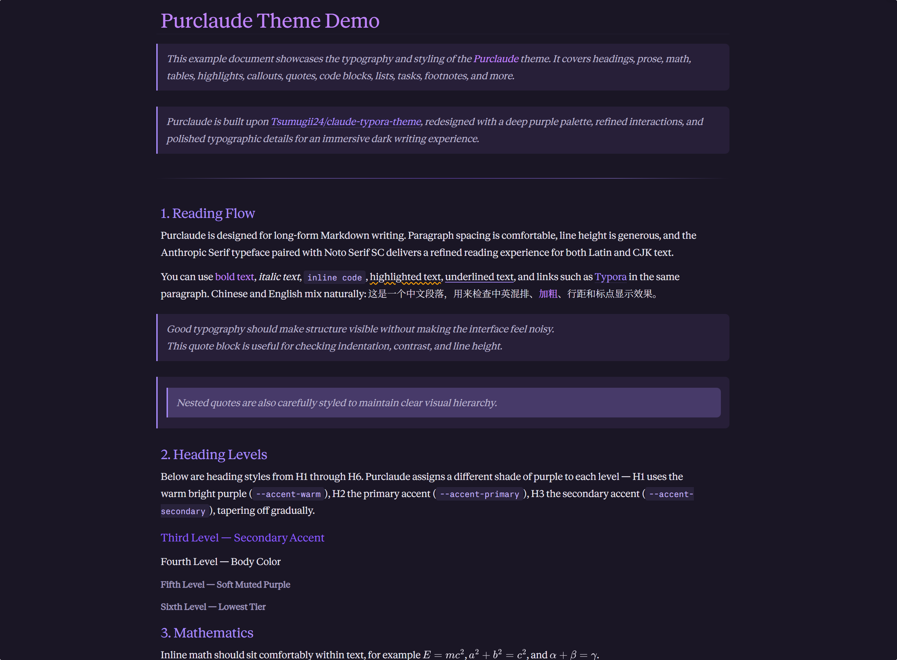

# Purclaude

A refined dark purple theme for [Typora](https://typora.io/), combining the elegance of deep purple tones with a sophisticated reading and writing experience. Inspired by [Claude](https://anthropic.com/) aesthetics.



## Features

- **Deep Purple Palette** — Rich, eye-friendly purple tones (`#1a1625` base)
- **Elegant Typography** — Anthropic serif for body text, sans-serif for UI, monospace for code
- **Syntax Highlighting** — Carefully tuned colors for code blocks
- **Smooth Interactions** — Polished hover states, selections, and animations
- **CJK Support** — Full Chinese typography support with Noto Serif SC
- **Focus Mode** — Dimmed non-active paragraphs for distraction-free writing

## Installation

1. Download or clone this repository.
2. Copy `purclaude.css` and the `purclaude/` folder to your Typora themes directory:
   - **Windows**: `%APPDATA%\Typora\themes\`
   - **macOS**: `~/Library/Application Support/Typora/themes/`
   - **Linux**: `~/.config/Typora/themes/`
3. Restart Typora and select **Purclaude** from **Preferences → Appearance → Themes**.

## File Structure

```
typora-theme-purclaude/
├── purclaude.css              # Main theme stylesheet
├── purclaude/                 # Theme assets
│   ├── AnthropicSansWebText.ttf
│   ├── AnthropicSerifWebText.ttf
│   ├── AnthropicMonoVariable.ttf
│   └── NotoSerifSC-VariableFont_wght.ttf
├── screenshots/               # Theme screenshots
│   └── main.png
├── LICENSE
└── README.md
```

## Customization

The theme uses CSS custom properties for easy customization. Edit these variables in `purclaude.css`:

```css
:root {
    --bg-color: #1a1625;           /* Main background */
    --accent-primary: #a78bfa;     /* Primary accent */
    --accent-secondary: #8b5cf6;   /* Secondary accent */
    --accent-warm: #c084fc;        /* Warm accent */
    --font-color: #e8e4f0;         /* Main text color */
}
```

## Screenshots

> **TODO**: Add your theme screenshots here.

## License

[MIT License](LICENSE)

## Credits

- **Design**: Inspired by [Claude](https://anthropic.com/) theme aesthetics
- **Fonts**: Anthropic Web Fonts + [Noto Serif SC](https://fonts.google.com/noto/specimen/Noto+Serif+SC)